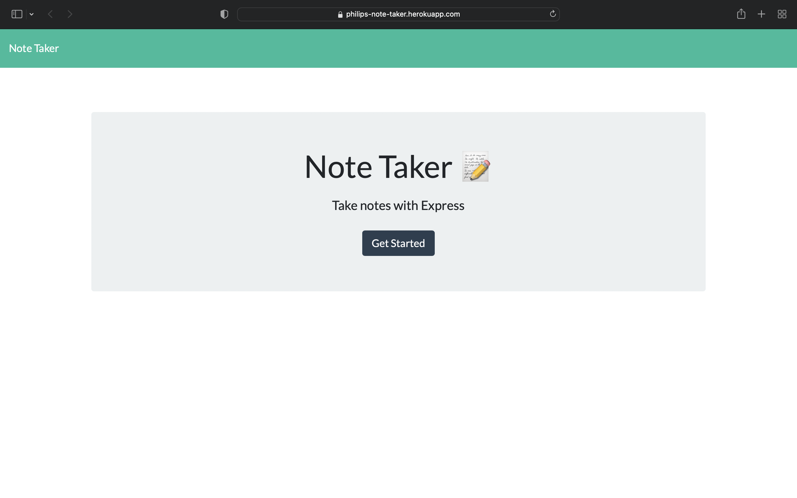
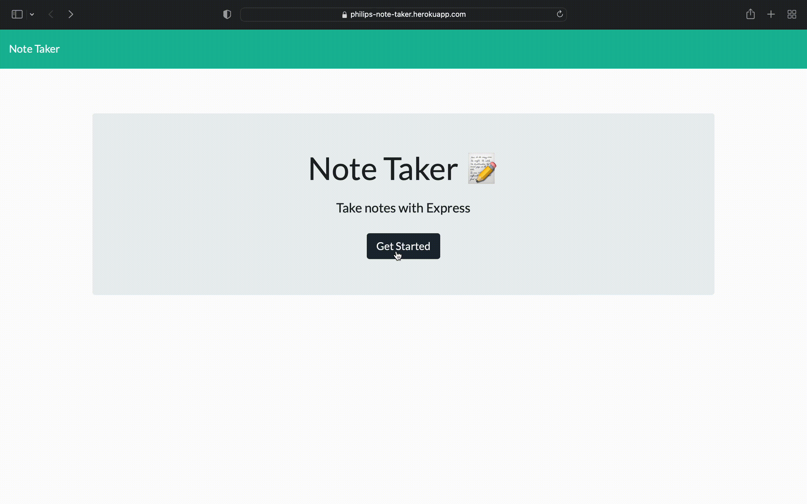

# Homework-11---Express-Note-Taker
Create an application called Note Taker that can be used to write and save notes,using Express. 

<p align = "center">

</p>

## Description
 This application allows a user to write, save, delete, and view previously saved notes. It uses an Express backend to save and retrive note data from a JSON file. The app can be used in the terminal, or using Heroku. The following are the routes used:
### HTML Routes
* GET /notes - Returns the notes.html file.
* GET * - Returns the index.html file
### API Routes
* GET /api/notes - Reads the db.json file and returns all saved notes as JSON.
* POST /api/notes - Receives a new note to save on the request body, adds it to the db.json file, and then returns the new note to the client.
* DELETE /api/notes/:id - Receives a query parameter containing the id of a note to delete, removes the note with the given id property, and then rewrites the notes to the db.json file.
## Note Taker Demo 

Video Demo for the application:

<p align = "center">

</p>

## Table of Contents

- [Homework-11---Express-Note-Taker](#homework-11---express-note-taker)
  - [Description](#description)
    - [HTML Routes](#html-routes)
    - [API Routes](#api-routes)
  - [Note Taker Demo](#note-taker-demo)
  - [Table of Contents](#table-of-contents)
  - [Resources](#resources)
  - [Installation](#installation)
  - [Usage](#usage)
  - [License](#license)
  - [Questions](#questions)

## Resources

* [Node.js](https://nodejs.org/)
* [Express](https://expressjs.com/)
* [Heroku](https://heroku.com)

## Installation

To install dependencies, run the following in your terminal:

```
npm i 
```
## Usage

After installations are completed, run the app with: 

```
node server.js
```
## License

* Copyright 2022 Philip Hwang
* This repository is licensed under the [MIT license](./LICENSE).

## Questions

If you have any questions, please contact me at: 
* Email: [pshwang93@gmail.com](mailto:pshwang93@gmail.com). 
* GitHub: [phwang93](https://github.com/phwang93).
* Repo: [Homework-11---Express-Note-Taker](https://github.com/phwang93/Homework-11---Express-Note-Taker).
* Heroku: [Note Taker App](https://philips-note-taker.herokuapp.com).